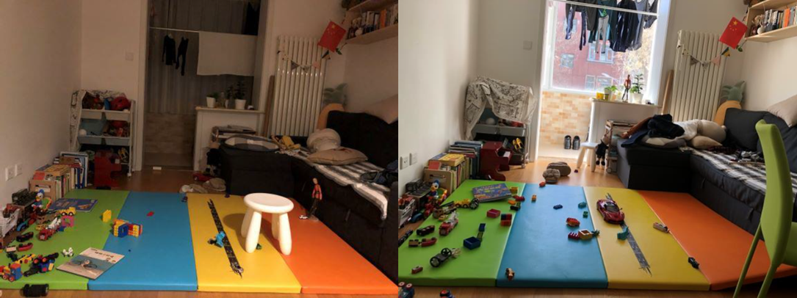

# Lifelong SLAM in the Real Environment

> We apologize for the delay of dataset release and competition launching due to some corrupted sensor data. We have fixed the issues and re-collected data. The competition will be launched around end of July. Please stay tuned!

In most real-world robotic scenarios, robots should be able to long-termly operate in dynamic and daily changing environments, and SLAM should be one of their most fundemental capabilities. However, most existing SLAM frameworks are evaluated in static environments, or in scenes containing some apparent dynamics such as moving people and objects. This competition brings new challenges by introducing *out-of-sight scene changes*. For example, in home scenarios, most objects may be movable or deformable, and the visual features of the same place may be significantly different in some successive days. Such out-of-sight dynamics pose challenges to the robustness of (re-)localization and the reusability of mapping, which to our knowledge have not been well studied. We use the term *Lifelong SLAM* to emphasize the capability of long-term mapping and robust localization.

[{:width="640px"}](home.png)

The dataset for this competition is collected in homes, offices, and other indoor places. Data are collected for multiple times in each place, to get scene changes in real life. Ground-truth trajectories are acquired by a motion capture system and other auxiliary means. Benchmarking tools will be released to evaluate SLAM algorithms in the lifelong setting.

Though the problem of *Lifelong SLAM* may be bit different from conventional SLAM, we will do our best to provide user-frinedly data format and evaluation tools to ensure minimum overhead of participating this competition.

# Data

The competition will use a subset of [the OpenLORIS-Scene Dataset](https://lifelong-robotic-vision.github.io/dataset/scene.html). The data are from a university building (office and corridor), a home, a supermarket, and a café. There are 3 to 5 trajectories in each scene, recorded at different times. For each scene, all the trajectories shall be feed to the SLAM algorithm in a predefined order. The algorithm will get a notification when loading a new sequence, and shall re-estimate its state since the robot may have been moved from the last location of the previous trajectory. However, participants may choose to get a pseudo-ground-truth starting state for each trajectory if re-localization is not supported by their SLAM algorithm. In this way their algorithm will get no score for re-localization.

Participants may choose from monocular, depth-only, RGB-D, or stereo fisheye as visual input of their algorithm, and use IMU or odometry data as they wish. The algorithm shall be evaluated in a real-time way, i.e., the data shall be feed to the algorithm at their original rate, and the immediate output of the algorithm shall be evaluated (rather than a trajectory after offline optimization). The participants shall either play ROS bags without changing the publish rate, or run their algorithm with [SLAMBench](https://github.com/pamela-project/slambench2). We will provide benchmarking tools for both methods.

For more details of the data, please visit [the OpenLORIS-Scene Dataset](https://lifelong-robotic-vision.github.io/dataset/scene.html).

# Competition Task

- Participants should build a visual or visual-inertial SLAM system to join the competition.
- Participants can choose a subset of sensor data for their algorithm, e.g. monocular or RGB-D, with IMU or without.
- The SLAM system is encouraged to have re-localization capability to deal with kidnapped robot issue and to recover from tracking failures.
- The SLAM system is encouraged to make use of semantic information for robust localization in changed scenes.
- The SLAM system is encouraged to be power efficient (i.e. being able to run on an edge device instead of servers).

More detailed rules are under discussion. Please feel free to [contact us](mailto:xuesong.shi@intel.com) to negotiate for your best interest.

# Evaluation Metrics

We will introduce some new metrics for this competition, as traditional SLAM evaluation (e.g. ATE, RPE) measures mostly the accuracy of pose tracking. We will emphsize more on the robustness of tracking and re-localization. Specifically, success rate of localization for each frame will be evaluated. Please refer to [this paper](https://drive.google.com/file/d/10EBSxett6dFhl-6QJ0PW30c6RsSU_ZZu/view?usp=sharing) for more details.

# Registration

