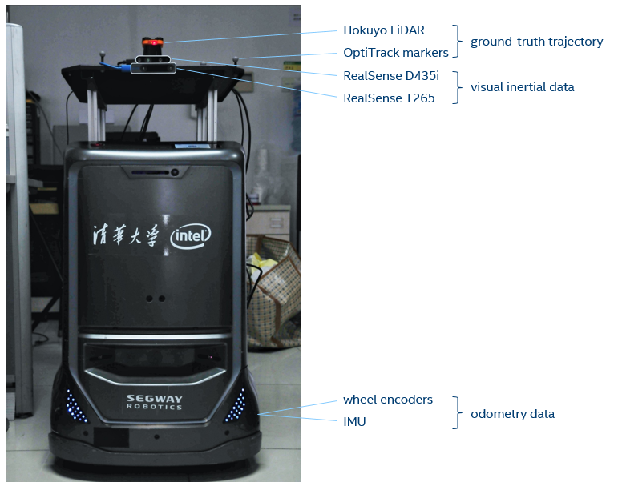

# OpenLORIS-Scene Dataset

The OpenLORIS-Scene dataset aims to help evaluate the maturity of SLAM and scene
understanding algorithms for real-world deployment, by providing *visual*,
*inertial* and *odometry* data recorded with real robots in real scenes, and
ground-truth robot trajectories acquired by motion capture system or
high-resolution LiDARs. Multiple trajectories will be provided for each scene,
to capture natural scene changes in real life.

OpenLORIS is an open dataset. We welcome contribution of data from third
parties. We can help with sensor setup, calibration, data collection and
post-processing. Please contact [Xuesong Shi](mailto:xuesong.shi@intel.com) for
collaboration.

For now the data are available only to competition participants of [Lifelong SLAM
Challenge]({{site.url}}{{site.baseurl}}/competition/SLAM.html) with IROS 2019.
[Register the competition](http://sv.mikecrm.com/jTS0wi7) to get the dataset at the earliest!

## Robot and Sensors

The data is collected by a wheeled robot moving at human walking speed or
slower. The primary sensors include a RealSense D435i camera and a RealSense
T265 camera, both mounted at a fixed height of about 1m. The color images and
depth images from D435i are recommended for monocular/RGB-D algorithms, while
the dual fisheye images from T265 are recommended for stereo algorithms. Both
provide IMU measurements with hardware synchronization with corresponding images.
Odometry data from wheel encoders will also be provided.

List of available data:

| device | data          | FPS | resolution |
|--------|---------------|-----|------------|
| D435i  | color         | 30  | 848x480    |
| D435i  | depth         | 30  | 848x480    |
| D435i  | aligned_depth | 30  | 848x480    |
| D435i  | accel         | 250 |            |
| D435i  | gyro          | 400 |            |
| T265   | fisheye1      | 30  | 848x800    |
| T265   | fisheye2      | 30  | 848x800    |
| T265   | accel         | 62.5|            |
| T265   | gyro          | 200 |            |
| base   | odom          | 20  |            |

## Ground-truth

For SLAM evaluation, the ground-truth trajectory of the robot is obtained by a
motion capture system or a LiDAR, with alignment to either D435i color camera and
T265 left camera.

**[Pre-register the competition](mailto:xuesong.shi@intel.com?subject=Pre-register%20for%20Lifelong%20Robotic%20Vision%20Competition&Body=Dear%20Organizers,%0D%0A) and get the first time notice when the data be available!**

